# Document Index & Master Registry

- **Purpose**: Central navigation index, identifier taxonomy, project glossary, and registry of assumptions and open questions for the CampusCare engineering pack.
- **Status**: Draft v1
- **Last Updated**: 2026-09-29
- **Depends On**: None (Master Entry Point)

---

## 1. Documentation Pack Table of Contents

| Document | File Path | Primary Purpose |
|---|---|---|
| **00_INDEX** | `/docs/00_INDEX.md` | Master registry, reading sequence, identifier convention, glossary, and assumption catalog. |
| **01_PRD** | `/docs/01_PRD.md` | Product Requirements Document: user personas, journeys, functional and non-functional requirements. |
| **02_TRD** | `/docs/02_TRD.md` | Technical Requirements Document: stack justifications, performance budgets, environments, and CI/CD. |
| **03_UIUX** | `/docs/03_UIUX.md` | User Interface & Experience Design System: design tokens, WCAG 2.2 AA rules, sitemap, screen wireframes. |
| **04_ARCHITECTURE** | `/docs/04_ARCHITECTURE.md` | System Architecture: Mermaid ERD, database schemas, API contracts, sequence diagrams, failure modes. |
| **05_SECURITY** | `/docs/05_SECURITY.md` | Security & Access Governance: STRIDE threat model, RBAC matrix, DPDP/GDPR alignment, OWASP defenses. |
| **06_TICKETS** | `/docs/06_TICKETS.md` | Engineering Ticket Backlog: atomic work units with Given/When/Then acceptance criteria and traceability. |
| **07_RULES** | `/docs/07_RULES.md` | Autonomous Agent Constitution: strict Do/Avoid rules, dependency lock, error handling, and Definition of Done. |
| **08_PHASES** | `/docs/08_PHASES.md` | Phased Delivery Roadmap: Phase 0 walking skeleton through MVP milestone gates and testable exit criteria. |
| **09_MASTER_PROMPT** | `/docs/09_MASTER_PROMPT.md` | Copy-paste orchestration prompt for powering coding subagents across all development sessions. |

---

## 2. Mandatory Reading Order

To ensure full technical and context alignment, all human developers and AI coding agents must read the documentation pack in the following sequence:

```mermaid
flowchart LR
    R07["07_RULES.md (Constitution)"] --> R01["01_PRD.md (Requirements)"]
    R01 --> R02["02_TRD.md (Technical Specs)"]
    R02 --> R03["03_UIUX.md (Interface Design)"]
    R03 --> R04["04_ARCHITECTURE.md (Data & APIs)"]
    R04 --> R05["05_SECURITY.md (Hardening & Compliance)"]
    R05 --> R06["06_TICKETS.md (Execution Backlog)"]
    R06 --> R08["08_PHASES.md (Delivery Milestones)"]
    R08 --> R09["09_MASTER_PROMPT.md (Session Driver)"]
```

---

## 3. Identification Conventions

Every requirement, technical constraint, ticket, and test case across the documentation pack strictly uses the following identifier taxonomy:

| Identifier Prefix | Meaning | Example | Format & Range |
|---|---|---|---|
| **FR-xxx** | Functional Requirement | `FR-001` | 3-digit zero-padded number (`FR-001` to `FR-099`) |
| **NFR-xxx** | Non-Functional Requirement | `NFR-001` | 3-digit zero-padded number (`NFR-001` to `NFR-099`) |
| **TR-xxx** | Technical Architecture Requirement | `TR-001` | 3-digit zero-padded number (`TR-001` to `TR-099`) |
| **T-xxx** | Implementation Engineering Ticket | `T-001` | 3-digit zero-padded number (`T-001` to `T-099`) |
| **SEC-xxx** | Security Mitigation / Policy | `SEC-001` | 3-digit zero-padded number (`SEC-001` to `SEC-099`) |
| **SCR-xxx** | User Interface Screen ID | `SCR-001` | 3-digit zero-padded number (`SCR-001` to `SCR-099`) |

---

## 4. Glossary of Domain & Technical Terms

| Term | Definition |
|---|---|
| **Anonymous ID** | A pseudonymous identifier (format: `anon_<6_chars><6_chars>`) generated on student signup to shield clinical records from educational rosters. |
| **Agora RTC** | Real-Time Communication WebRTC audio/video SDK facilitating peer-to-peer 1-on-1 virtual counseling channels. |
| **Clinical Note** | Restricted psychiatric or psychological assessment record created by a campus counselor during or after student consultations. |
| **DPDP Act 2023** | Digital Personal Data Protection Act of India, mandating strict purpose limitation and pseudonymisation for health and student telemetry. |
| **In-Memory Fallback** | Local Node.js runtime memory store activated when Supabase credentials are unset, ensuring full local testability without cloud dependencies. |
| **LTCE** | Lokmanya Tilak College of Engineering, the reference institution for department configurations and clinical staff deployment. |
| **RLS** | Row-Level Security in PostgreSQL, enforcing authorization rules at the database engine level. |
| **Walking Skeleton** | A minimal end-to-end implementation linking frontend, backend, database, and telemetry to prove architectural viability. |

---

## 5. Consolidated Registry of Assumptions `[ASSUMPTION]`

| ID | Location | Assumption Details | Rationale & Validation Plan |
|---|---|---|---|
| **ASM-001** | `01_PRD.md` | Primary student authentication relies on institutional or Google Mail (`@gmail.com`) domain verification. | Selected to prevent duplicate registrations and protect campus community authenticity. |
| **ASM-002** | `01_PRD.md` | Single campus counselor persona (Ms. Shahista Kazi) handles departmental student intakes in MVP Phase. | Reflects current staffing structure for LTCE counseling department. Multi-counselor routing planned for v2. |
| **ASM-003** | `02_TRD.md` | Agora WebRTC App ID and Certificate are utilized in token-authenticated mode for all sessions. | Ensures room sessions cannot be snooped or hijacked by unauthorized channel joins. |
| **ASM-004** | `02_TRD.md` | Supabase Cloud (ap-south-1 Mumbai) serves as the primary PostgreSQL host with 100% relational schema parity to local PG. | Eliminates cross-region data latency (<30ms) for Mumbai-based educational institutions. |
| **ASM-005** | `03_UIUX.md` | Desktop display width is prioritized for counselor administrative workstations (1280px+), with mobile responsiveness for students (360px+). | Counselors manage case notes on office PCs; students access bookings, chatbot, and crisis hotline on smartphones. |

---

## 6. Consolidated Registry of Open Questions `[OPEN QUESTION]`

| ID | Question Details | Impacted Areas | Owner / Resolution Date |
|---|---|---|---|
| **OQ-001** | Should institutional Google Workspace SSO (`@ltce.in`) completely supersede generic `@gmail.com` addresses once institutional OAuth keys are provided? | `01_PRD.md`, `05_SECURITY.md` | Campus IT Admin / Pre-Phase 4 |
| **OQ-002** | Will campus counselors require cloud recording of video consultations, or is zero-retention ephemeral WebRTC legally mandated? | `01_PRD.md`, `04_ARCHITECTURE.md` | Student Welfare Dean / Phase 3 Gate |
| **OQ-003** | Does state mental health compliance require mandatory emergency escalation dispatch if high-risk suicidal intent keywords are flagged in Chatbot? | `01_PRD.md`, `05_SECURITY.md` | Institutional Legal Counsel / Phase 3 |
