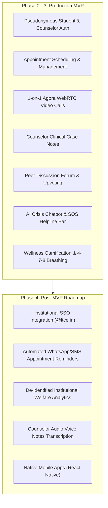

# Product Requirements Document (PRD)

- **Purpose**: Defines product vision, target user personas, end-to-end user journeys, functional and non-functional requirements, and acceptance criteria for CampusCare.
- **Status**: Draft v1
- **Last Updated**: 2026-09-29
- **Depends On**: `/docs/00_INDEX.md`

---

## 1. Vision & Problem Statement

### 1.1 Problem Statement
College engineering students face acute academic pressure, burnout, social isolation, and anxiety regarding semester examinations and placements. Due to deep social stigma and fear of academic repercussions, over 74% of struggling students avoid approaching campus psychological counseling departments directly. Furthermore, campus counseling cells rely on manual paper logbooks, creating privacy hazards, missed appointments, and absence of longitudinal clinical progress tracking.

### 1.2 Product Vision
CampusCare is a confidential, fullstack digital mental health platform engineered specifically for collegiate institutions. By decoupling clinical identities through cryptographically generated pseudonymous Anonymous IDs, CampusCare empowers students to seek professional guidance, engage in 1-on-1 WebRTC encrypted video counseling sessions, participate in moderated peer communities, track daily wellness habits, and access 24/7 crisis de-escalation tools with zero fear of exposure.

---

## 2. Goals & Measurable Success Metrics

| Goal ID | Objective | Measurable Metric | Target Value | Measurement Methodology |
|---|---|---|---|---|
| **MTR-001** | Increase student counseling adoption | Monthly Booked Sessions | >= 120 sessions/month | Database query count of `appointments` with `status != 'cancelled'`. |
| **MTR-002** | Zero identity leakage | Stigma Barrier Breaches | Exactly 0 incidents | Security audit verifying zero student real names in public forum or peer telemetry. |
| **MTR-003** | Rapid emergency helpline access | Time to Crisis Dial Access | < 3 seconds | Telemetry measuring client tap-to-dial trigger on Emergency SOS components. |
| **MTR-004** | Consultation attendance reliability | Session No-Show Rate | <= 12% | Ratio of `cancelled`/no-show appointments vs total confirmed bookings over 30 days. |
| **MTR-005** | Daily habit engagement | 7-Day Habit Retention | >= 38% | Percentage of registered students logging mood or meditation >= 3 days per week. |

---

## 3. Non-Goals (Out of Scope for MVP)

1. **Commercial Payments & Billing**: Campus counseling is provided free of charge by the institution; no payment gateways (Stripe, Razorpay) are included.
2. **Multi-Party Group Video Therapy**: Video rooms are strictly 1-on-1 between one student and one licensed counselor. Group video calls are excluded.
3. **Prescription & Pharmacological Management**: No psychiatric drug dispensing, prescription generation, or pharmacy integrations.
4. **Third-Party Hospital EHR Sync**: No external hospital Electronic Health Record (HL7/FHIR) sync in MVP.

---

## 4. User Personas

### Persona 1: Aarav Sharma (Engineering Student)
- **Role**: 2nd Year B.Tech Student, Computer Engineering, LTCE.
- **Context**: Experiencing severe exam-related panic attacks and insomnia. Terrified that faculty or peers will discover he is seeking therapy.
- **Goals**: Book a virtual counseling slot without his classmates finding out; practice grounding exercises before exams; read experiences of peers in similar situations.
- **Pain Points**: Fear of academic bias if mental health struggles are exposed; finds counseling center queues public and humiliating.

### Persona 2: Ms. Shahista Kazi (Campus Psychological Counselor)
- **Role**: Official Faculty Counselor & Student Welfare Lead, LTCE.
- **Context**: Manages hundreds of student intakes across 7 engineering branches; needs organized rosters, attendance status, and secure case notes.
- **Goals**: View daily/weekly appointment calendars; conduct virtual 1-on-1 video sessions with remote students; maintain confidential clinical case files with diagnostic notes and action plans.
- **Pain Points**: Chaotic paper registers, students missing scheduled physical visits due to timetable clashes, zero unified history for follow-up sessions.

### Persona 3: Prof. Dr. S. K. Patil (Dean of Student Welfare & Admin)
- **Role**: Institutional Welfare Administrator.
- **Context**: Requires aggregate institutional wellness telemetry (stress trends, peak panic periods during semester exams) while strictly respecting student privacy laws.
- **Goals**: Access anonymized monthly engagement metrics (number of consultations, most common tags in self-care library, crisis hotline taps).
- **Pain Points**: Lacks actionable data to allocate wellness resources; fears legal non-compliance under data privacy regulations.

---

## 5. Top 3 User Journeys

### Journey 1: Confidential Counselor Booking & Live WebRTC Video Consultation
1. **Discovery & Auth**: Student visits CampusCare, signs up with `@gmail.com`, and receives pseudonymous `anon_x89a12` identifier.
2. **Booking**: Student navigates to `/booking`, selects date/slot with Ms. Shahista Kazi, enters intake reason ("Semester exam panic"), and confirms.
3. **Counselor Confirmation**: Counselor logs into `/booking`, reviews intake reason, and confirms status.
4. **Video Consultation**: At the designated slot, student navigates to `/video-call?channel=campuscare-room-101`. Counselor enters from her dashboard. Both camera and audio feeds establish peer-to-peer over Agora WebRTC.
5. **Clinical Record**: Following the call, Counselor opens `/counselor-notes`, logs severity ("Moderate"), observations, and an action plan, persisting to `clinical_notes`.

### Journey 2: 24/7 Crisis Intervention & AI Chatbot De-escalation
1. **Acute Distress Entry**: Student experiencing a midnight panic attack clicks "Talk now" or opens `/chatbot`.
2. **Conversational Support**: AI chatbot greets student pseudonymously, detects distress keywords, validates feelings, and guides student through an interactive 4-7-8 breathing pacing cycle.
3. **Escalation Choice**: Chatbot presents two actionable cards: "Book Priority Counselor Slot" and "Call 24/7 Tele-MANAS Helpline (14416)".
4. **Resolution**: Student executes 3 cycles of breathwork, feels stabilized, and books a counseling slot for the following morning.

### Journey 3: Peer Support Engagement in Anonymous Student Forum
1. **Community Discovery**: Student feeling isolated in the hostel navigates to `/forum`.
2. **Filter & Browse**: Student filters posts by the tag `Loneliness` and sorts by `Popular`.
3. **Interaction**: Student upvotes helpful advice and clicks on a post titled "Feeling disconnected since moving to campus".
4. **Contribution**: Student posts an anonymous comment: *"Joining the robotics club really helped me meet seniors."*
5. **Real-Time Feedback**: Likes and comment counters update in Supabase; author identity is displayed strictly as a chosen pseudonym with zero email exposure.

---

## 6. Functional Requirements (FR)

| ID | Description | Priority | Target Persona | Linked Tickets |
|---|---|---|---|---|
| **FR-001** | System must support pseudonymous registration with institutional/Gmail domain verification and automated Anonymous ID generation (`anon_xxxxxx`). | Must | Student | `T-004`, `T-005` |
| **FR-002** | System must authenticate students using either Anonymous ID or verified Email with Bcrypt password hashing. | Must | Student | `T-004`, `T-005` |
| **FR-003** | System must provide dedicated credential authentication for institutional counselors (`Ms. Shahista Kazi`) with role escalation. | Must | Counselor | `T-004`, `T-005` |
| **FR-004** | Student must be able to view counselor availability, select time slots, enter confidential intake reasons, and book appointments. | Must | Student | `T-006` |
| **FR-005** | Counselor must be able to view booked appointments roster, filter by date, update status (`confirmed`, `completed`, `cancelled`), and read student intake notes. | Must | Counselor | `T-006` |
| **FR-006** | System must establish 1-on-1 virtual video counseling rooms utilizing Agora WebRTC with dynamic token authorization. | Must | Student, Counselor | `T-007`, `T-008` |
| **FR-007** | Video calling interface must provide mute/unmute, camera toggle, screen sharing, call timer, and responsive dual video grid (remote primary + local PiP). | Must | Student, Counselor | `T-007` |
| **FR-008** | System must automatically provide synthetic video/audio fallback streaming when physical webcam is locked by another local browser tab. | Must | Student, Counselor | `T-007` |
| **FR-009** | Counselor must be able to create, view, edit, and categorize confidential clinical case notes linked to student Anonymous IDs. | Must | Counselor | `T-009` |
| **FR-010** | Student community forum must support creating discussion posts with category tags (`Anxiety`, `Sleep`, `Academic Stress`, `Loneliness`, `Wellness Tips`, `General`). | Must | Student | `T-010`, `T-011` |
| **FR-011** | Forum must support threaded comment replies and duplicate-prevented upvoting/liking per user Anonymous ID. | Must | Student | `T-010`, `T-011` |
| **FR-012** | Forum must provide real-time keyword search, category filtering, and sorting (`Recent` vs `Popular`). | Must | Student | `T-010` |
| **FR-013** | AI Mental Health Chatbot must provide empathetic conversational responses, panic de-escalation, and interactive breathwork guidance. | Must | Student | `T-012` |
| **FR-014** | System must maintain a persistent Emergency Crisis Footer with direct one-tap dialing for Tele-MANAS (14416), KIRAN (1800-599-0019), and campus security. | Must | Student | `T-003` |
| **FR-015** | Wellness gamification engine must calculate user XP, tiered levels (1–6), milestone badges, and daily active check-in streaks. | Should | Student | `T-013` |
| **FR-016** | Interactive 4-7-8 breathing pacer with visual animation circles must guide self-regulation exercises. | Should | Student | `T-013` |
| **FR-017** | Self-Care Library must offer searchable multimedia resources (guided videos, audio meditations, reading guides). | Should | Student | `T-014` |
| **FR-018** | Institutional welfare analytics dashboard must aggregate appointment counts and stress categories without exposing student IDs. | Could | Admin | `T-015` |

---

## 7. Non-Functional Requirements (NFR)

| ID | Category | Metric / Specification | Verification Method |
|---|---|---|---|
| **NFR-001** | Performance | Web First Contentful Paint (FCP) < 1.2s; Largest Contentful Paint (LCP) < 2.0s on 4G networks. | Lighthouse CLI audit in CI pipeline. |
| **NFR-002** | API Latency | 95th percentile (p95) API response time < 150ms for auth and booking queries. | Automated Autocannon benchmark. |
| **NFR-003** | WebRTC Quality | End-to-end video stream latency < 350ms with jitter < 30ms over standard broadband. | Agora Analytics dashboard telemetry. |
| **NFR-004** | Accessibility | Full compliance with WCAG 2.2 Level AA; minimum 4.5:1 text contrast ratio; keyboard traversable. | Automated Axe-core test suite. |
| **NFR-005** | Availability | System uptime >= 99.8% during academic working semesters. | Cloud health monitor polling `/api/health`. |
| **NFR-006** | Data Privacy | Zero cleartext student PII in public tables; 100% compliance with India DPDP Act 2023 principles. | Static AST code analysis and RLS policy verification. |
| **NFR-007** | Security | Cryptographic passwords hashed via Bcrypt (work factor 10); JWT tokens signed via HMAC-SHA256. | Automated unit security tests. |

---

## 8. User Stories & Acceptance Criteria (Must Requirements)

### US-001: Pseudonymous Student Registration (FR-001)
- **User Story**: As a distressed student, I want to create an account using my Gmail but receive a random Anonymous ID so that my counseling records cannot be linked to my college identity.
- **Acceptance Criteria**:
  - *Given* a student enters a valid `@gmail.com` address and password >= 6 characters.
  - *When* the student submits the registration form.
  - *Then* the backend generates a unique `anon_<rand12>` identifier, hashes the password with Bcrypt, persists the record, returns a signed JWT, and displays the Anonymous ID in a copyable modal.

### US-002: Confidential Session Booking (FR-004, FR-005)
- **User Story**: As a student, I want to select a counseling date and time slot with Ms. Shahista Kazi so that I can secure professional help.
- **Acceptance Criteria**:
  - *Given* an authenticated student on the `/booking` route.
  - *When* the student selects a future date, chooses an available slot (e.g., "11:00 AM"), enters an intake concern, and submits.
  - *Then* an appointment record is inserted into `public.appointments` with `status = 'confirmed'`, and immediately renders in the Counselor's dashboard view.

### US-003: 1-on-1 WebRTC Video Session (FR-006, FR-007, FR-008)
- **User Story**: As a student or counselor, I want to join an encrypted virtual consultation room so that we can have a face-to-face therapeutic discussion remotely.
- **Acceptance Criteria**:
  - *Given* an authenticated user navigating to `/video-call?channel=session-101`.
  - *When* the user permits camera/mic and clicks "Enter Video Call".
  - *Then* the backend generates an Agora token via `POST /api/agora/token`, the client connects to Agora RTC, publishes audio/video, and renders the remote peer's video feed in full screen while rendering the local video in PiP. If the local camera is locked by another local tab, the system seamlessly transmits the synthetic virtual video stream without crashing.

### US-004: Counselor Clinical Case Management (FR-009)
- **User Story**: As a campus counselor, I want to log session observations, category, and severity so that I can track student therapeutic progress over time.
- **Acceptance Criteria**:
  - *Given* an authenticated user with `role = 'counselor'` on `/counselor-notes`.
  - *When* the counselor fills in clinical observations, selects severity ("High Risk"), inputs an action plan, and clicks Save.
  - *Then* the record is persisted to `public.clinical_notes` and indexed under the student's `student_anon_id`.

### US-005: Community Peer Discussion & Upvoting (FR-010, FR-011, FR-012)
- **User Story**: As a student, I want to share my challenges and upvote coping strategies anonymously on a campus forum.
- **Acceptance Criteria**:
  - *Given* an authenticated student on `/forum`.
  - *When* the student inputs a title, body, and selects tag `Anxiety`, and clicks Post.
  - *Then* the post appears in the feed with `likes_count = 0`; clicking upvote increments the counter, creates a row in `forum_likes`, and clicking again revokes the upvote.

---

## 9. Scope Phasing: MVP vs Post-MVP Backlog

---

## 10. Risks, Assumptions & Open Questions

- **Risk RSK-001**: WebRTC connection dropouts on poor hostel Wi-Fi networks.
  - *Mitigation*: Agora VP8 codec with adaptive bitrate downscaling (audio priority fallback below 100 kbps).
- **Assumption ASM-001**: Students possess smartphone or laptop access capable of WebRTC media streaming.
- **Assumption ASM-002**: A single designated counselor profile fulfills institutional counseling volume for Phase 1.
- **Open Question OQ-001**: Should emergency crisis triage dispatch automated alerts to campus security when explicit self-harm threats are submitted in Forum or Chatbot?
