# Technical Requirements Document (TRD)

- **Purpose**: Defines technical specifications, technology stack justifications, architectural budgets, environments, CI/CD pipelines, and observability for CampusCare.
- **Status**: Draft v1
- **Last Updated**: 2026-09-29
- **Depends On**: `/docs/01_PRD.md`

---

## 1. Technology Stack Architecture

| Layer | Selected Technology | Version | Justification | Alternative Rejected & Rationale |
|---|---|---|---|---|
| **Frontend Framework** | React | `^19.2.4` | Modern component model, virtual DOM diffing, native transition support, ecosystem maturity. | **Angular**: Excessive boilerplate and complex dependency injection overhead. |
| **Frontend Build Tool** | Vite | `^8.0.0` | Sub-second Hot Module Replacement (HMR), fast Rollup production bundling, native ESM support. | **Webpack**: Slower cold start and high configuration maintenance. |
| **Client Routing** | React Router DOM | `^7.13.1` | Declarative client-side routing, route guard nesting (`ProtectedRoute`), smooth SPA page transitions. | **TanStack Router**: Steeper learning curve for open academic maintainers. |
| **UI Iconography** | Lucide React | `^1.48.0` | Accessible tree-shakeable SVG icon set with consistent 24x24 visual footprint and zero runtime bloat. | **FontAwesome**: Heavy asset payload and font rendering inconsistency. |
| **Backend Runtime** | Node.js | `>=20.0.0` (LTS) | Asynchronous non-blocking event loop, unified JavaScript/ESM across fullstack codebase. | **Python/Flask**: Requires multi-runtime management and split serialization libraries. |
| **Backend Framework** | Express.js | `^5.2.1` | Lightweight, robust middleware pipeline, native promise handling, zero framework lock-in. | **NestJS**: Excessive abstraction layers for straightforward REST endpoints. |
| **Database Engine** | Supabase (PostgreSQL) | `Postgres 17` | Relational integrity, native JSONB support, built-in Row-Level Security (RLS), and zero-ops hosting. | **MongoDB**: Lack of foreign key enforcement between appointments and users. |
| **WebRTC Video Engine** | Agora Web SDK | `v4.22.0` | Global low-latency SD-RTN network, automatic packet-loss concealment, VP8 hardware acceleration. | **Raw WebRTC / PeerJS**: Lacks institutional NAT/firewall traversal (STUN/TURN infrastructure). |
| **Authentication/Security** | JWT + BcryptJS | `^9.0.3` / `^3.0.3` | Cryptographic password hashing (cost factor 10), stateless bearer tokens for API authorization. | **Session Cookies**: Complicates cross-origin mobile clients and serverless scaling. |

---

## 2. Technical Requirements Mapping (TR)

| ID | Description | Linked FR ID | Verification Method |
|---|---|---|---|
| **TR-001** | Backend must implement modular REST router endpoints under `/api/auth`, `/api/bookings`, `/api/agora`, `/api/forum`, and `/api/gamification`. | `FR-001` to `FR-015` | Supertest integration test suite verifying HTTP 200/201/400/401 codes. |
| **TR-002** | User passwords must be hashed using `bcrypt.hash(password, 10)` before storing in `public.users`. | `FR-002`, `FR-003` | Automated unit test checking that stored hash starts with `$2b$10$` and validates against plain text. |
| **TR-003** | Agora RTC tokens must be generated server-side using `RtcTokenBuilder.buildTokenWithUid` with role privileges expiring in 3600 seconds. | `FR-006` | Backend unit test verifying HMAC signature and token expiration timestamp. |
| **TR-004** | VideoCall component must handle local camera hardware locking by gracefully switching to an animated canvas virtual stream via `createCustomVideoTrack`. | `FR-008` | Automated browser mock test simulating `NotReadableError` and asserting stream generation. |
| **TR-005** | VideoCall component must render remote peers using dedicated React ref components (`RemoteVideoPlayer`) to eliminate DOM race conditions. | `FR-006`, `FR-007` | React Testing Library checking container mounting and `user.videoTrack.play()` execution. |
| **TR-006** | Forum post upvotes must use relational uniqueness (`UNIQUE(user_anon_id, post_id)`) to enforce idempotent like toggling. | `FR-011` | SQL constraint test asserting error on duplicate manual insert and correct API toggle behavior. |
| **TR-007** | Backend must include resilient in-memory data structures (`fallbackAppointments`, `mockPosts`) when `isSupabaseConfigured` evaluates to false. | `NFR-005` | Test suite running with empty Supabase environment variables ensuring 100% route survival. |

---

## 3. Concrete Performance Budgets

| Metric | Target Budget | Maximum Hard Threshold | Measurement Tool |
|---|---|---|---|
| **Initial JS Bundle Size** | < 220 kB (gzipped) | 300 kB (gzipped) | `vite build` Rollup bundle analysis output. |
| **Total CSS Payload** | < 25 kB (gzipped) | 40 kB (gzipped) | `vite build` CSS asset reporter. |
| **First Contentful Paint (FCP)** | < 1.0 s | 1.4 s | Chrome Lighthouse Mobile (slow 4G throttling). |
| **Largest Contentful Paint (LCP)** | < 1.8 s | 2.5 s | Chrome Lighthouse Mobile (slow 4G throttling). |
| **Cumulative Layout Shift (CLS)** | < 0.02 | 0.05 | Chrome Web Vitals real-user monitoring. |
| **API Response Time (p95)** | < 120 ms | 250 ms | Autocannon load test at 100 concurrent requests/sec. |
| **WebRTC Session Join Time** | < 1.5 s | 3.0 s | Client telemetry measuring click-to-peer-playback time. |

---

## 4. Environment Configurations

CampusCare defines three isolated operational environments:

| Environment | Purpose | Database Host | WebRTC Config | Deployment Target |
|---|---|---|---|---|
| **Local (Development)** | Rapid engineer coding & unit testing. | Local Supabase Docker / In-Memory Mock. | Agora Sandbox App ID (Token bypass / Local Token Server). | `http://localhost:5173` (Vite) / `http://localhost:5000` (Node) |
| **Staging** | Automated CI validation, preview builds, QA. | Supabase Dev Branch (`campuscare-stage`). | Agora Production App ID (Mumbai Region). | Vercel Preview + Render Staging Web Service. |
| **Production** | Live institutional counseling portal. | Supabase Production Project (`ap-south-1`). | Dedicated Agora Enterprise Project. | Vercel Production + Cloud Container (Docker/K8s). |

---

## 5. Third-Party Services, Quotas & Costs

| Service | Purpose | Free Tier Allowance | Production Quota & Limits | Estimated Monthly Cost |
|---|---|---|---|---|
| **Supabase** | PostgreSQL DB, Auth, Storage, Edge APIs. | 500 MB database, 50,000 MAU, 5 GB egress. | 8 GB disk, 100,000 MAU, daily backups. | \$0 (Free Tier) / \$25/mo (Pro Tier) |
| **Agora.io** | WebRTC Audio/Video Streaming Network. | 10,000 free video minutes per month. | Up to 1,000 concurrent consultation channels. | \$0 (under 10k min) / \$3.99 per 1,000 min thereafter |
| **Vercel** | Frontend Edge SPA Hosting & CDN. | 100 GB bandwidth, unlimited serverless invocations. | Edge network caching with global SSL. | \$0 (Hobby) / \$20/mo (Team) |

---

## 6. Continuous Integration & Deployment (CI/CD)

```mermaid
flowchart LR
    GitPush["Git Push (Feature Branch)"] --> Lint["ESLint & Prettier Check"]
    Lint --> UnitTests["Unit Tests (Vitest & Jest)"]
    UnitTests --> BuildTest["Vite Production Build"]
    BuildTest --> SecurityAudit["NPM Audit & Dependency Scan"]
    SecurityAudit --> PreviewDeploy["Deploy Vercel Preview"]
    PreviewDeploy --> PRApproval["Code Review & PR Merge to main"]
    PRApproval --> ProdDeploy["Deploy Production Pipeline"]
```



- **CI Pipeline Configuration**: GitHub Actions workflow (`.github/workflows/ci.yml`) triggered on all Pull Requests targeting `main`.
- **Merge Gate**: Branch protection rules require zero lint warnings, 100% unit test pass rate, and successful `vite build` before merging.

---

## 7. Testing Strategy & Coverage Targets

| Test Level | Framework / Tool | Scope | Minimum Coverage Target |
|---|---|---|---|
| **Unit Tests (Client)** | Vitest + React Testing Library | Context providers (`AuthContext`), pure utilities, breathing timer. | >= 85% line coverage |
| **Unit Tests (Server)** | Vitest / Jest + Supertest | Token generation, course validators, Bcrypt hashing, gamification XP. | >= 90% line coverage |
| **Component Integration** | React Testing Library | `VideoCall.jsx` (local/remote rendering), `Modals.jsx`, `Forum.jsx`. | >= 80% line coverage |
| **End-to-End (E2E)** | Playwright | Full student registration -> counselor booking -> video join flow. | 100% of top 3 user journeys |
| **Accessibility (a11y)** | axe-core / Playwright-axe | All public screens for WCAG 2.2 AA contrast, labels, focus management. | 0 critical/serious violations |

---

## 8. Observability & Telemetry

- **Structured Logging**: Backend writes JSON logs containing `timestamp`, `level` (`info`, `warn`, `error`), `reqId`, `route`, `statusCode`, and `latencyMs`.
- **Health Probing**: Endpoint `GET /api/health` queries Supabase heartbeat and reports runtime uptime and database status.
- **Client Error Boundary**: React top-level `ErrorBoundary` traps unhandled rendering exceptions, renders a graceful recovery UI, and dispatches error telemetry with stack trace stripped of PII.
- **WebRTC Diagnostics**: Agora client event hooks monitor `network-quality`, `uplinkNetworkQuality`, and `downlinkNetworkQuality`, displaying real-time connection status indicators to users.

---

## 9. Proposed Repository Structure

```
CampusCare/
├── .github/
│   └── workflows/
│       └── ci.yml                 # Automated CI test & build pipeline
├── database/
│   └── supabase_schema.sql        # Canonical DDL migrations and seed scripts
├── docs/                          # Complete Engineering Documentation Pack
│   ├── 00_INDEX.md
│   ├── 01_PRD.md
│   ├── 02_TRD.md
│   ├── 03_UIUX.md
│   ├── 04_ARCHITECTURE.md
│   ├── 05_SECURITY.md
│   ├── 06_TICKETS.md
│   ├── 07_RULES.md
│   ├── 08_PHASES.md
│   └── 09_MASTER_PROMPT.md
├── server/                        # Express.js REST API Backend
│   ├── config/
│   │   └── supabase.js            # Supabase client instantiation & health probes
│   ├── routes/
│   │   ├── agora.js               # WebRTC token builder & session lifecycle
│   │   ├── auth.js                # Registration, login, Google sync, JWT issue
│   │   ├── bookings.js            # Appointment slots, intake status, clinical notes
│   │   ├── forum.js               # Posts CRUD, threaded comments, upvoting
│   │   └── gamification.js        # XP calculations, streaks, milestone badges
│   ├── index.js                   # Server entrypoint and middleware mounting
│   └── package.json
├── src/                           # React 19 Frontend SPA
│   ├── components/
│   │   ├── EmergencyFooter.jsx    # 24/7 National and campus helpline bar
│   │   ├── Modals.jsx             # Accessible login, registration, and confirmation dialogs
│   │   ├── Navbar.jsx             # Role-aware responsive navigation shell
│   │   └── ProtectedRoute.jsx     # Client-side RBAC route gatekeeper
│   ├── config/
│   │   └── supabaseClient.js      # Client Supabase and OAuth provider bootstrap
│   ├── context/
│   │   └── AuthContext.jsx        # Authentication state, session sync, localStorage persistence
│   ├── pages/
│   │   ├── About.jsx              # Institutional counseling vision & facilities
│   │   ├── Booking.jsx            # Student scheduling & counselor appointment desk
│   │   ├── Chatbot.jsx            # AI conversational de-escalation & breathwork
│   │   ├── CounselorNotes.jsx     # Clinical case files & longitudinal progress
│   │   ├── CounselorProfile.jsx   # Faculty bio, specialties, office hours
│   │   ├── Forum.jsx              # Community peer discussion & category search
│   │   ├── Gamification.jsx       # Daily habits, streaks, 4-7-8 breathing pacer
│   │   ├── Home.jsx               # Student authenticated dashboard
│   │   ├── Resources.jsx          # Psychoeducational self-care media library
│   │   └── VideoCall.jsx          # Agora WebRTC 1-on-1 video call room
│   ├── styles/
│   │   └── tokens.css             # Canonical CSS custom property design system
│   ├── App.jsx                    # Route mapping, global shortcuts, theme provider
│   ├── index.css                  # Global utility, typography, and modal stylesheets
│   └── main.jsx                   # React root hydration entrypoint
├── index.html                     # HTML5 shell loading fonts and Agora RTC CDN
├── package.json                   # Root workspace manifest and concurrently runner
├── vercel.json                    # Single-page application URL rewrite rules
└── vite.config.js                 # Vite compiler configuration & proxy rules
```

---

## 10. Environment Variable Schema (Names Only)

Under zero circumstances may credential values be committed to repository code. Developers configure environment files according to this schema:

### Frontend Client Variables (`.env`)
- `VITE_SUPABASE_URL`
- `VITE_SUPABASE_ANON_KEY`

### Backend Server Variables (`server/.env`)
- `PORT`
- `JWT_SECRET`
- `SUPABASE_URL`
- `SUPABASE_ANON_KEY`
- `SUPABASE_SERVICE_ROLE_KEY`
- `DATABASE_URL`
- `AGORA_APP_ID`
- `AGORA_APP_CERTIFICATE`

---

## 11. Technical Risk & Mitigation Matrix

| Risk ID | Technical Risk Description | Severity | Mitigation Strategy |
|---|---|---|---|
| **TR-RSK-001** | Single-laptop developer cannot open webcam in two separate tabs due to OS device locking (`NotReadableError`). | High | Automated fallback to `createCustomVideoTrack` with synthetic animated canvas video feed. |
| **TR-RSK-002** | Supabase Cloud connection outage breaks local development or unit testing. | Medium | Built-in in-memory fallback stores (`fallbackAppointments`, `mockPosts`) active whenever Supabase is unreachable. |
| **TR-RSK-003** | Agora WebRTC token expiration during long therapeutic sessions exceeding 60 minutes. | Medium | Token builder configures a generous 3600-second privilege expiry, with proactive client renewal listener. |
| **TR-RSK-004** | Client-side memory leaks caused by abandoned Agora tracks or audio oscillator contexts. | Low | Comprehensive `useEffect` cleanup handlers invoking `track.close()` and `track.stop()` on unmount. |

---

## 12. Architectural Decision Log (ADR)

| Decision ID | Context & Options Considered | Chosen Decision | Technical Consequence |
|---|---|---|---|
| **ADR-001** | **Database Schema Approach**: (A) Direct PostgreSQL tables vs (B) Supabase managed profiles only. | **Choice: Hybrid Architecture** (Standalone `users` table + Supabase `profiles` bridge). | Guarantees backend Express server can run against standard Postgres without hard lock-in to Supabase Auth. |
| **ADR-002** | **WebRTC Room Authorization**: (A) Open unauthenticated rooms vs (B) HMAC signed Agora RTC tokens. | **Choice: Server-generated Agora RTC Tokens**. | Precludes unauthorized URL snooping; room access requires valid JWT session and server-generated token. |
| **ADR-003** | **Design Token Architecture**: (A) Tailwind CSS vs (B) Vanilla CSS Custom Properties (`tokens.css`). | **Choice: Vanilla CSS Tokens** (`--brand-blue`, `--surface`, etc.). | Zero compiler runtime overhead, instant browser dark-mode switching, absolute maintainability without Tailwind build steps. |
