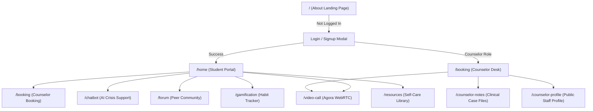

# UI/UX Design System Specification

- **Purpose**: Defines design tokens, WCAG 2.2 AA accessibility requirements, component states, sitemap, user interaction flows, and detailed specifications for every screen in CampusCare.
- **Status**: Draft v1
- **Last Updated**: 2026-09-29
- **Depends On**: `/docs/01_PRD.md`, `/docs/02_TRD.md`

---

## 1. Core Design Principles

1. **Psychological Safety & Calmness**: Generous whitespace, restorative muted slate and ocean blue hues (`--brand-blue: #2676a6`), elimination of jarring transitions or aggressive alerts.
2. **Absolute Anonymity by Default**: Interfaces never demand or display student institutional roll numbers or cleartext names in public views.
3. **Restrained Administrative Polish**: Professional collegiate aesthetic avoiding juvenile gamification gimmicks or dark particle canvases; clean borders (`1px solid #e4ebef`) and subtle elevation.
4. **Immediate Emergency Escape**: Emergency hotlines and de-escalation controls remain permanently accessible within 1 tap from any screen.

---

## 2. Design Tokens Specification

### 2.1 Color Palette

```
Light Theme Palette:
Primary Brand Blue:  #2676a6  ██████  [--brand-blue]
Brand Blue Dark:     #195e89  ██████  [--brand-blue-dark]
Brand Blue Pale:     #eaf4fa  ██████  [--brand-blue-pale]
Surface White:       #ffffff  ██████  [--surface]
Page Background:     #f8fafc  ██████  [--page-bg]
Sidebar Gray:        #f0f5f8  ██████  [--sidebar-bg]
Text Primary:        #344653  ██████  [--text-primary]
Text Secondary:      #728592  ██████  [--text-secondary]
Border Default:      #e4ebef  ██████  [--border]
Health Green:        #62ad45  ██████  [--green]
Alert Coral:         #df685a  ██████  [--coral]
Teal Focus:          #32a5b2  ██████  [--teal]
Warning Orange:      #d8844e  ██████  [--orange]
```

### 2.2 Typography Scale
- **Primary Typeface**: `'Inter', -apple-system, BlinkMacSystemFont, 'Segoe UI', Roboto, sans-serif`
- **Monospace Code/Timer**: `'SF Mono', Menlo, Monaco, Consolas, monospace`

| Token | Font Size | Line Height | Font Weight | Usage Context |
|---|---|---|---|---|
| `display-1` | 36px (2.25rem) | 1.2 | 700 (Bold) | Hero headline, major landing titles |
| `h1` | 28px (1.75rem) | 1.25 | 700 (Bold) | Main page titles, video call title |
| `h2` | 22px (1.375rem) | 1.3 | 600 (Semi-Bold) | Section headers, card group titles |
| `h3` | 18px (1.125rem) | 1.4 | 600 (Semi-Bold) | Modal titles, forum post titles |
| `body-base` | 14px (0.875rem) | 1.5 | 400 (Regular) | Primary content, post bodies, notes |
| `body-medium` | 14px (0.875rem) | 1.5 | 500 (Medium) | Navigation links, form labels, buttons |
| `caption` | 12px (0.75rem) | 1.4 | 500 (Medium) | Meta timestamps, badges, micro-tags |

### 2.3 Spacing, Radii & Elevation
- **Spacing Scale**: `4px` (xxs), `8px` (xs), `12px` (sm), `16px` (md), `24px` (lg), `32px` (xl), `48px` (2xl)
- **Border Radii**:
  - `--radius-sm`: `4px` (buttons, form inputs, badges)
  - `--radius-md`: `8px` (cards, containers, modals)
  - `--radius-full`: `100px` (pill badges, floating call controls)
- **Shadows**:
  - `--shadow-subtle`: `0 1px 3px rgba(35, 65, 90, 0.04)`
  - `--shadow-card`: `0 2px 12px rgba(35, 65, 90, 0.05)`
  - `--shadow-dropdown`: `0 8px 28px rgba(35, 65, 90, 0.12)`
- **Breakpoints**: Mobile (`<= 768px`), Tablet (`769px – 1024px`), Desktop (`>= 1025px`), Max Content Width (`1500px`).

---

## 3. Component Inventory & State Matrix

| Component | Default State | Hover State | Focus-Visible State | Disabled State | Error / Active State |
|---|---|---|---|---|---|
| **Button Primary** | Background `#2676a6`, text `#ffffff` | Background `#195e89`, translateY(-1px) | 2px solid `#2676a6`, 2px offset | Opacity 0.55, cursor not-allowed | Active: scale(0.98) |
| **Button Secondary** | Background `#ffffff`, border `1px solid #e4ebef` | Background `#f0f5f8`, border `#cbd8e1` | 2px solid `#2676a6`, 2px offset | Opacity 0.5, border `#e4ebef` | Active: `#e4ecf1` |
| **Form Input** | Surface `#ffffff`, border `#e4ebef` | Border `#cbd8e1` | Border `#2676a6`, box-shadow ring | Background `#f0f5f8`, color `#8c9ea9` | Error: border `#c74444`, alert caption |
| **Tag Filter Pill** | Background `#ffffff`, text `#728592` | Background `#eaf4fa`, text `#2676a6` | 2px solid `#2676a6` | Opacity 0.4 | Selected: bg `#eaf4fa`, text `#2676a6`, weight 600 |
| **Call Action Button** | Circle 44px, bg `rgba(255,255,255,0.15)` | Background `rgba(255,255,255,0.25)` | 2px solid `#ffffff` | Opacity 0.5 | Active-Warn (Muted/Off): bg `#ef4444` |
| **Modal Container** | Backdrop blur 4px, surface `#ffffff`, radius 8px | N/A | N/A | N/A | Scrollable `max-height: 90vh` |

---

## 4. Sitemap & Navigation Flows



---

## 5. Screen Specifications

### SCR-001: Public About / Landing Screen (`/`)
- **Purpose**: Welcomes visitors, explains campus counseling confidentiality guarantees, showcases LTCE counseling facilities, and triggers auth modals.
- **Route**: `/` (for unauthenticated visitors)
- **Layout**: Hero banner left, institutional accreditation panel right, 4 feature KPI cards below.
- **Components**: `Navbar`, `FeatureCard`, `HeroIllustration`, `EmergencyFooter`.
- **States**: Default, Mobile Drawer Open.
- **Real Copy**: *"Confidential, empathetic mental health care designed for collegiate engineering students."*
- **Mobile Behavior**: Single-column vertical stacking, sticky mobile join button at bottom.

### SCR-002: Student Home Dashboard (`/home`)
- **Purpose**: Primary dashboard for authenticated students displaying quick links, daily streak, mood check-in prompt, and booked consultation reminders.
- **Route**: `/home`
- **Layout**: Welcome greeting with Anonymous ID, 3 status KPI summary cards, quick action grid.
- **Components**: Daily mood widget, Upcoming appointment reminder card, 4-7-8 breathing quick launch card.

### SCR-003: Counselor Booking Desk (`/booking`)
- **Purpose**: Dual-mode booking interface allowing students to reserve appointment slots and counselors to manage daily student rosters.
- **Route**: `/booking` (also aliases `/appointments`, `/counselor`)
- **Layout**:
  - *Student View*: Calendar date picker, time slot selector buttons, intake reason text area, "Confirm Appointment" CTA.
  - *Counselor View*: Roster data table (Date, Slot, Student Name/Anon ID, Branch, Intake Reason, Status dropdown, Join Video Room action).
- **Components**: Date selector, slot chips, appointment status badge (`confirmed`=green, `completed`=teal, `cancelled`=coral).

### SCR-004: Agora WebRTC Video Call Room (`/video-call`)
- **Purpose**: Provides high-definition 1-on-1 virtual counseling session with local camera preview, screen sharing, and audio controls.
- **Route**: `/video-call?channel=:channelId`
- **Layout**: 3 distinct visual phases:
  - *Phase 1 (Pre-Call)*: Centered card with live camera preview, mic/camera toggle buttons, channel input, "Open Peer Tab" button.
  - *Phase 2 (In-Call)*: Edge-to-edge dark canvas (`#090f17`), dominant remote peer video, local user PiP bottom-right, floating glassmorphic control bar.
  - *Phase 3 (Post-Call)*: Session completion summary card with duration timer, room ID, return to dashboard CTA.
- **Components**: `RemoteVideoPlayer`, `LocalVideoPlayer`, floating pill control bar, call timer badge.

### SCR-005: Counselor Clinical Notes System (`/counselor-notes`)
- **Purpose**: Private clinical case filing cabinet for counselors to record session observations, diagnostic severity, and therapeutic action plans.
- **Route**: `/counselor-notes`
- **Layout**: Two-column layout with student case history sidebar on left and rich clinical note editor on right.
- **Components**: Severity dropdown (`Mild`, `Moderate`, `High Risk`), file name input, structured observations editor.

### SCR-006: Counselor Public Profile (`/counselor-profile`)
- **Purpose**: Displays counselor credentials, education, departmental affiliations, and scheduled office consultation hours.
- **Route**: `/counselor-profile`
- **Components**: Verified faculty badge, photo upload preview, specialization tag pills.

### SCR-007: Peer Community Forum (`/forum`)
- **Purpose**: Safe anonymous student discussion board to share challenges, exchange coping tips, and upvote constructive advice.
- **Route**: `/forum`
- **Layout**: Top search & filter bar, expandable "Create Post" card, vertical Reddit-style feed of discussion cards with comment threads.
- **Components**: Search input, category pill chips, vertical upvote counter button, nested comment thread items.

### SCR-008: AI Mental Health Chatbot (`/chatbot`)
- **Purpose**: 24/7 immediate conversational triage, empathetic active listening, crisis de-escalation, and grounding exercises.
- **Route**: `/chatbot`
- **Layout**: Centered conversational chat container with message thread history, quick response prompt pills, and message input field.
- **Components**: Bot message bubble, user message bubble, quick coping suggestions, interactive breathwork trigger.

### SCR-009: Self-Care Resource Library (`/resources`)
- **Purpose**: Psychoeducational repository of guided meditation audio tracks, breathing exercises, and clinical coping articles.
- **Route**: `/resources`
- **Layout**: Grid of media cards with embedded video modal viewer and category filtering.
- **Components**: Multimedia resource cards, duration label chips, category filter dropdown.

### SCR-010: Wellness Gamification & Habit Tracker (`/gamification`)
- **Purpose**: Daily routine reinforcement through XP progression, active check-in streaks, milestone badges, and an interactive 4-7-8 breathing pacer.
- **Route**: `/gamification`
- **Layout**: Tiered level badge header, 7-day calendar check-in row, animated breathing pacer circle, badge showcase grid.
- **Components**: 4-7-8 animated breathing circle, XP progress bar, unlocked badge cards.

### SCR-011: Authentication & Registration Dialogs (Modals)
- **Purpose**: Dual-mode login and registration overlay supporting student Anonymous ID creation and verified counselor access.
- **Route**: Global Modal (`openModal('login')` / `openModal('signup')`)
- **Layout**: Two-column wide modal (`.modal-wide`) with vertical scrolling (`max-height: 90vh; overflow-y: auto;`) and top-right close button.
- **Components**: Role toggle tab switch, Google sign-in trigger, institutional department dropdown, copyable Anonymous ID success card.

---

## 6. Accessibility Specification (WCAG 2.2 Level AA)

1. **Color Contrast**: All text elements achieve a minimum contrast ratio of 4.5:1 against their background. Large headers (>= 24px) achieve >= 3.0:1.
2. **Keyboard Navigation**: All interactive buttons, inputs, and links have visible focus outlines (`2px solid var(--brand-blue)` with `2px offset`) and can be operated solely using `Tab`, `Enter`, `Space`, and `Escape`.
3. **Screen Reader Semantics**: All icons include `aria-hidden="true"`, buttons include descriptive `aria-label` attributes (e.g. `aria-label="Turn microphone off"`), and form fields link to explicit `<label>` tags.
4. **Reduced Motion**: Respects the `prefers-reduced-motion: reduce` media query by disabling all pulsing animations and transform scaling.

---

## 7. Motion & Microcopy Standards

- **Transitions**: Standard ease `cubic-bezier(0.4, 0, 0.2, 1)` with `150ms` duration for buttons and `220ms` for theme/modal transitions.
- **Tone of Voice**: Empathetic, respectful, non-judgmental, clinically grounded.
  - *Do*: "Take a slow breath. You're in a safe, confidential space."
  - *Avoid*: "Calm down! Everything is fine."
- **Asset List**:
  - `public/favicon.svg`: Green leaf and wellness emblem.
  - `public/favicon.ico`: Legacy browser compatibility icon.
