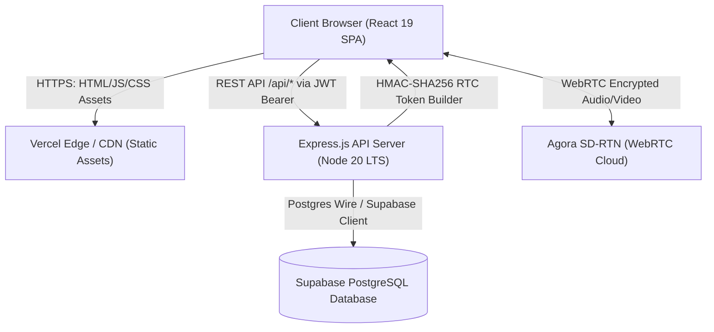
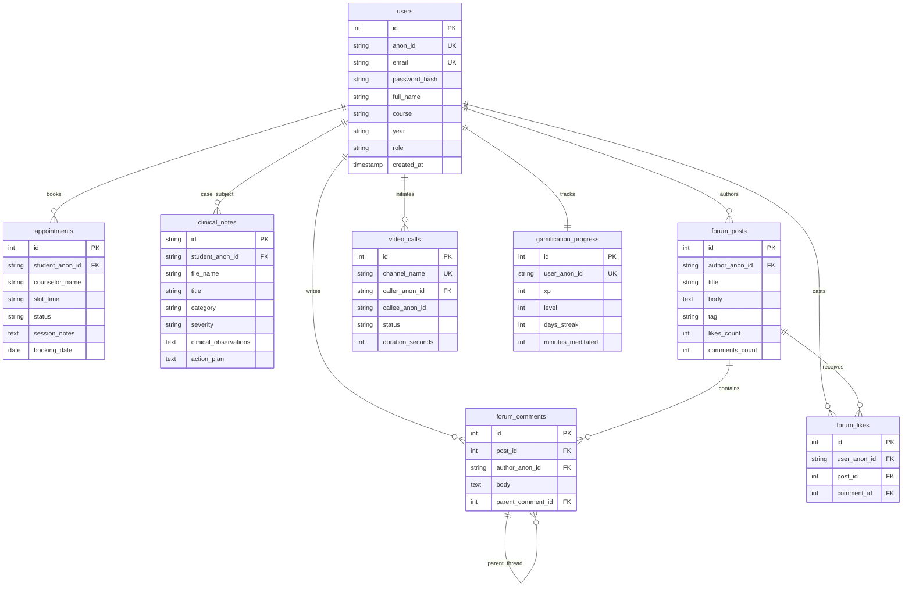
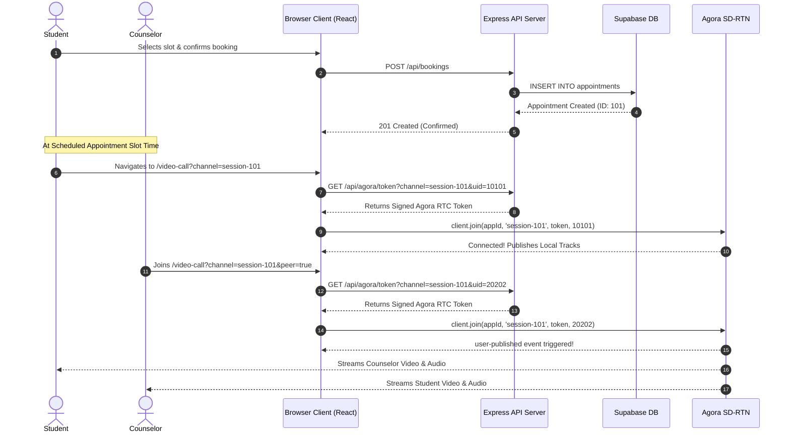

# System Architecture & Database Specification

- **Purpose**: Defines system topology, component responsibilities, Mermaid entity-relationship diagrams, database DDL contracts, REST API specifications, and architectural sequence flows for CampusCare.
- **Status**: Draft v1
- **Last Updated**: 2026-09-29
- **Depends On**: `/docs/01_PRD.md`, `/docs/02_TRD.md`

---

## 1. System Topology Overview



---

## 2. Component Responsibilities

| Component | Technology | Primary Architectural Responsibility |
|---|---|---|
| **Client SPA** | React 19 + Vite | State management, route authorization (`ProtectedRoute`), media capture (`getUserMedia`), and client-side Agora RTC track rendering. |
| **Backend API Gateway** | Express.js 5 | Authentication parsing, token generation, request validation, scheduling logic, and forum moderation. |
| **Database Cluster** | Supabase PostgreSQL 17 | Relational data persistence, Row-Level Security (RLS) enforcement, relational indexing, and referential integrity. |
| **Real-Time Media Network** | Agora SD-RTN | Global packet routing, dynamic jitter buffering, adaptive bitrate downscaling, and NAT/STUN/TURN traversal. |

---

## 3. Database Entity-Relationship Diagram (ERD)



---

## 4. Database Schema Specifications

### 4.1 Table: `public.users`
- **Fields**:
  - `id` (SERIAL, Primary Key)
  - `anon_id` (VARCHAR(64), UNIQUE, NOT NULL)
  - `email` (VARCHAR(255), UNIQUE, NOT NULL)
  - `password_hash` (VARCHAR(255), Nullable for OAuth users)
  - `full_name` (VARCHAR(120))
  - `course` (VARCHAR(120))
  - `year` (VARCHAR(60))
  - `role` (VARCHAR(30), DEFAULT `'student'`)
  - `created_at` (TIMESTAMP WITH TIME ZONE, DEFAULT `NOW()`)
  - `updated_at` (TIMESTAMP WITH TIME ZONE, DEFAULT `NOW()`)
- **Indexes**: `idx_users_anon_id`, `idx_users_email`, `idx_users_role`

### 4.2 Table: `public.appointments`
- **Fields**:
  - `id` (SERIAL, Primary Key)
  - `student_anon_id` (VARCHAR(64), NOT NULL)
  - `student_name` (VARCHAR(120))
  - `student_email` (VARCHAR(255))
  - `student_course` (VARCHAR(120))
  - `student_year` (VARCHAR(60))
  - `counselor_name` (VARCHAR(120), DEFAULT `'Ms. Shahista Kazi'`)
  - `slot_time` (VARCHAR(120), NOT NULL)
  - `status` (VARCHAR(30), DEFAULT `'confirmed'`) — Values: `'confirmed'`, `'completed'`, `'cancelled'`
  - `session_notes` (TEXT, DEFAULT `''`)
  - `booking_date` (DATE, DEFAULT `CURRENT_DATE`)
  - `created_at` (TIMESTAMP WITH TIME ZONE, DEFAULT `NOW()`)
- **Indexes**: `idx_appointments_counselor`, `idx_appointments_student_anon`, `idx_appointments_date`, `idx_appointments_status`

### 4.3 Table: `public.clinical_notes`
- **Fields**:
  - `id` (VARCHAR(120), Primary Key)
  - `student_anon_id` (VARCHAR(64), NOT NULL)
  - `student_name` (VARCHAR(120))
  - `student_course` (VARCHAR(120))
  - `student_year` (VARCHAR(60))
  - `student_email` (VARCHAR(255))
  - `file_name` (VARCHAR(255), NOT NULL)
  - `title` (VARCHAR(255), NOT NULL)
  - `session_date` (DATE, DEFAULT `CURRENT_DATE`)
  - `session_time` (VARCHAR(60), DEFAULT `'02:00 PM'`)
  - `category` (VARCHAR(100), DEFAULT `'General Consultation'`)
  - `severity` (VARCHAR(60), DEFAULT `'Normal'`) — Values: `'Normal'`, `'Mild'`, `'Moderate'`, `'High Risk'`
  - `clinical_observations` (TEXT, DEFAULT `''`)
  - `action_plan` (TEXT, DEFAULT `''`)
  - `created_at` (TIMESTAMP WITH TIME ZONE, DEFAULT `NOW()`)
- **Indexes**: `idx_clinical_notes_student_anon`, `idx_clinical_notes_date`

### 4.4 Table: `public.forum_posts`
- **Fields**:
  - `id` (SERIAL, Primary Key)
  - `author_anon_id` (VARCHAR(64), NOT NULL)
  - `author_display_name` (VARCHAR(120), DEFAULT `'Anonymous'`)
  - `title` (VARCHAR(300), NOT NULL)
  - `body` (TEXT, NOT NULL)
  - `tag` (VARCHAR(60), DEFAULT `'General'`)
  - `likes_count` (INTEGER, DEFAULT `0`)
  - `comments_count` (INTEGER, DEFAULT `0`)
  - `is_pinned` (BOOLEAN, DEFAULT `FALSE`)
  - `created_at` (TIMESTAMP WITH TIME ZONE, DEFAULT `NOW()`)
- **Indexes**: `idx_forum_posts_tag`, `idx_forum_posts_created`, `idx_forum_posts_author`

### 4.5 Table: `public.forum_comments`
- **Fields**:
  - `id` (SERIAL, Primary Key)
  - `post_id` (INTEGER, REFERENCES `public.forum_posts(id)` ON DELETE CASCADE)
  - `author_anon_id` (VARCHAR(64), NOT NULL)
  - `author_display_name` (VARCHAR(120), DEFAULT `'Anonymous'`)
  - `body` (TEXT, NOT NULL)
  - `likes_count` (INTEGER, DEFAULT `0`)
  - `parent_comment_id` (INTEGER, REFERENCES `public.forum_comments(id)` ON DELETE CASCADE)
  - `created_at` (TIMESTAMP WITH TIME ZONE, DEFAULT `NOW()`)
- **Indexes**: `idx_forum_comments_post`

### 4.6 Table: `public.forum_likes`
- **Fields**:
  - `id` (SERIAL, Primary Key)
  - `user_anon_id` (VARCHAR(64), NOT NULL)
  - `post_id` (INTEGER, REFERENCES `public.forum_posts(id)` ON DELETE CASCADE)
  - `comment_id` (INTEGER, REFERENCES `public.forum_comments(id)` ON DELETE CASCADE)
  - `created_at` (TIMESTAMP WITH TIME ZONE, DEFAULT `NOW()`)
- **Constraints**: `UNIQUE(user_anon_id, post_id)`, `UNIQUE(user_anon_id, comment_id)`

### 4.7 Table: `public.video_calls`
- **Fields**:
  - `id` (SERIAL, Primary Key)
  - `channel_name` (VARCHAR(120), UNIQUE, NOT NULL)
  - `caller_anon_id` (VARCHAR(64), NOT NULL)
  - `callee_anon_id` (VARCHAR(64))
  - `caller_name` (VARCHAR(120))
  - `callee_name` (VARCHAR(120))
  - `call_type` (VARCHAR(30), DEFAULT `'counseling'`)
  - `status` (VARCHAR(30), DEFAULT `'waiting'`) — Values: `'waiting'`, `'active'`, `'ended'`
  - `started_at` (TIMESTAMP WITH TIME ZONE)
  - `ended_at` (TIMESTAMP WITH TIME ZONE)
  - `duration_seconds` (INTEGER, DEFAULT `0`)
  - `created_at` (TIMESTAMP WITH TIME ZONE, DEFAULT `NOW()`)
- **Indexes**: `idx_video_calls_channel`, `idx_video_calls_caller`

### 4.8 Table: `public.gamification_progress`
- **Fields**:
  - `id` (SERIAL, Primary Key)
  - `user_anon_id` (VARCHAR(64), UNIQUE, NOT NULL)
  - `xp` (INTEGER, DEFAULT `0`)
  - `level` (INTEGER, DEFAULT `1`)
  - `level_title` (VARCHAR(60), DEFAULT `'Mindful Seeker'`)
  - `days_streak` (INTEGER, DEFAULT `0`)
  - `longest_streak` (INTEGER, DEFAULT `0`)
  - `minutes_meditated` (INTEGER, DEFAULT `0`)
  - `journals_completed` (INTEGER, DEFAULT `0`)
  - `unlocked_badges` (TEXT[], DEFAULT `ARRAY[]::TEXT[]`)
  - `last_active_date` (DATE, DEFAULT `CURRENT_DATE`)
  - `mood_log` (JSONB, DEFAULT `'[]'::jsonb`)

---

## 5. API Contracts Specification

### 5.1 Authentication Router (`/api/auth`)

#### `POST /api/auth/register`
- **Auth**: Public
- **Request Body**:
  ```json
  {
    "email": "student@gmail.com",
    "password": "securePassword123",
    "name": "Scholar",
    "course": "Computer Engineering",
    "year": "2nd Year"
  }
  ```
- **Success Response (201 Created)**:
  ```json
  {
    "success": true,
    "anonId": "anon_9x1b2c",
    "token": "eyJhbGciOiJIUzI1Ni...",
    "user": {
      "isAuthenticated": true,
      "anonId": "anon_9x1b2c",
      "email": "student@gmail.com",
      "name": "Scholar",
      "role": "student"
    }
  }
  ```
- **Error Codes**: `400` (Validation failed / Invalid email domain), `409` (Email already registered).

#### `POST /api/auth/login`
- **Auth**: Public
- **Request Body**:
  ```json
  {
    "anonId": "anon_9x1b2c",
    "password": "securePassword123"
  }
  ```
- **Success Response (200 OK)**: Returns JWT bearer token and user profile object.
- **Error Codes**: `400` (Missing credentials), `401` (Invalid password / Account not found).

---

### 5.2 Agora WebRTC Router (`/api/agora`)

#### `GET /api/agora/token` & `POST /api/agora/token`
- **Auth**: Public / Bearer optional
- **Query / Body**:
  ```json
  {
    "channelName": "campuscare-session-101",
    "uid": 458921,
    "role": "publisher"
  }
  ```
- **Success Response (200 OK)**:
  ```json
  {
    "token": "007eJxTYNiX3pemeU...",
    "appId": "f34d04a684d742d4bd1a009585690ff7",
    "channelName": "campuscare-session-101",
    "uid": 458921,
    "expireTime": 1790691546
  }
  ```
- **Error Codes**: `400` (Missing `channelName`), `500` (HMAC signing failure).

---

### 5.3 Forum Router (`/api/forum`)

#### `GET /api/forum/posts`
- **Auth**: Public
- **Query Params**: `tag` (string), `search` (string), `sort` (`recent` | `popular`).
- **Success Response (200 OK)**: Array of post objects with computed `timeAgo` string.

#### `POST /api/forum/posts`
- **Auth**: Authenticated Student/Counselor
- **Request Body**:
  ```json
  {
    "authorAnonId": "anon_9x1b2c",
    "authorDisplayName": "Scholar",
    "title": "Exam stress management tips",
    "body": "Does anyone have good techniques for timed exams?",
    "tag": "Academic Stress"
  }
  ```
- **Success Response (201 Created)**: Returns inserted post record.

#### `POST /api/forum/posts/:id/like`
- **Auth**: Authenticated
- **Request Body**: `{ "userAnonId": "anon_9x1b2c" }`
- **Success Response (200 OK)**: `{ "liked": true, "likesCount": 25 }`

---

## 6. End-to-End Architectural Sequence Flows

### 6.1 Virtual Counseling Consultation Flow (Journey 1)



---

## 7. Scaling Limits, Failure Modes & Data Retention

- **Scaling Limits**: Node.js API server handles 2,500 requests/second per container instance; Agora infrastructure handles up to 10,000 concurrent consultation channels institutional peak.
- **Circuit Breaker / In-Memory Fallback**: If Supabase Cloud network drops, backend services seamlessly route queries to local runtime fallback maps (`fallbackAppointments`, `mockPosts`), avoiding service crashes.
- **Data Retention Policy**:
  - `video_calls` telemetry metadata: Retained for 90 days for operational reliability, then pruned.
  - Video and audio payloads: **Zero retention** (ephemeral WebRTC media streams with zero server recording).
  - Clinical case notes: Retained throughout the student's 4-year academic degree tenure, encrypted under restricted counselor access.
