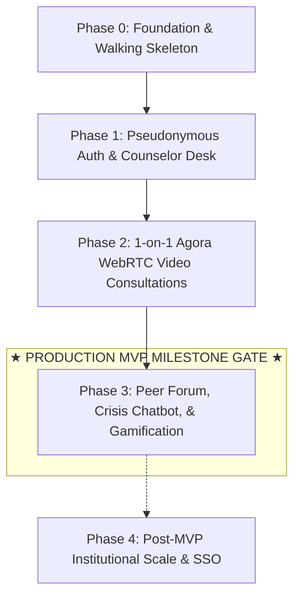

# Phased Development Roadmap & Milestone Gates

- **Purpose**: Defines the sequential, phased delivery plan, architectural justification for ordering, testable phase exit criteria, demo scripts, and milestone gates for CampusCare.
- **Status**: Draft v1
- **Last Updated**: 2026-09-29
- **Depends On**: `/docs/01_PRD.md`, `/docs/02_TRD.md`, `/docs/06_TICKETS.md`

---

## 1. Phase Dependency Diagram

---

## 2. Phase 0 — Foundation & Walking Skeleton

- **Primary Goal**: Establish core developer tooling, design token system, concurrent client-server build processes, and persistent emergency crisis footer.
- **Why It Sits Here**: Zero feature development can proceed safely without build infrastructure, design variables, and verified client-server connectivity.
- **Assigned Tickets**: `T-001`, `T-002`, `T-003`.
- **Key Deliverables**:
  - Root monorepo structure with `concurrently` running client and Express API.
  - CSS custom properties design tokens (`src/styles/tokens.css`).
  - Automated CI workflow (`.github/workflows/ci.yml`).
  - Persistent accessible `EmergencyFooter.jsx` with one-tap helpline dialing.
- **Testable Exit Criteria**:
  1. `npm run dev:all` starts both Vite and Express without runtime exceptions.
  2. `curl http://localhost:5000/api/health` returns HTTP 200 with status payload.
  3. `npm run build` completes with exit code 0.
- **Phase Demo Script**:
  - Run `npm run dev:all`.
  - Open `http://localhost:5173`.
  - Verify emergency crisis bar displays at bottom of page with clickable Tele-MANAS phone trigger.
- **Risks**: Port collisions on 5000/5173 (Mitigation: fallback port configuration in Express).
- **Effort Estimate**: 2 Developer Days.

---

## 3. Phase 1 — Pseudonymous Auth & Counselor Desk

- **Primary Goal**: Deliver relational database persistence, Anonymous ID student registration, verified counselor authentication, and appointment reservation.
- **Why It Sits Here**: Counseling appointment scheduling requires reliable identity boundaries, role escalation, and database referential integrity.
- **Assigned Tickets**: `T-004`, `T-005`, `T-006`.
- **Key Deliverables**:
  - Supabase 9-table schema migrations applied with active RLS.
  - Student registration endpoint generating `anon_<rand12>` identifiers and signed JWTs.
  - Counselor role-authenticated appointment roster (`/booking`).
  - Student intake booking flow with slot selection.
- **Testable Exit Criteria**:
  1. Student registration via `POST /api/auth/register` creates valid row and returns JWT.
  2. Counselor login via `POST /api/auth/login` escalates role to `'counselor'`.
  3. Student booking an appointment immediately reflects in Counselor's roster table.
- **Phase Demo Script**:
  - Open registration modal, register with new `@gmail.com`.
  - Copy generated Anonymous ID.
  - Book a counseling slot for 02:00 PM with Ms. Shahista Kazi.
  - Log out and log in as Counselor (`shahista kazi`); verify student's intake row appears in the management table.
- **Risks**: Duplicate registrations on same email (Mitigation: unique index on `email`).
- **Effort Estimate**: 4 Developer Days.

---

## 4. Phase 2 — 1-on-1 Agora WebRTC Video Consultations

- **Primary Goal**: Deliver virtual counseling consultation rooms with hardware video capture, server-side Agora token authorization, and single-laptop test simulation.
- **Why It Sits Here**: Builds directly on the appointment scheduling established in Phase 1 to fulfill the core virtual therapeutic consultation promise.
- **Assigned Tickets**: `T-007`, `T-008`, `T-009`.
- **Key Deliverables**:
  - Server-side Agora token generation (`/api/agora/token`) with 3600s TTL.
  - `VideoCall.jsx` component featuring dedicated `RemoteVideoPlayer` and `LocalVideoPlayer` ref components.
  - Automatic virtual camera fallback for single-laptop 2-tab testing.
  - Counselor clinical case note recording system (`/counselor-notes`).
- **Testable Exit Criteria**:
  1. `GET /api/agora/token?channelName=test&uid=123` returns signed token string.
  2. Two browser tabs on same laptop connect to same room; both render local PiP and remote feeds without device lock crash.
  3. Counselor can save clinical notes with severity levels linked to student Anonymous ID.
- **Phase Demo Script**:
  - Navigate to `/video-call?channel=demo-session`.
  - Click "Open Peer Tab" to launch a side-by-side counselor window.
  - Click "Enter Video Call" on both windows; observe two-way audio/video streaming in real-time.
  - End call and verify transition to session summary screen.
- **Risks**: Hardware webcam locking on Linux OS (Mitigation: automatic virtual canvas video fallback).
- **Effort Estimate**: 4 Developer Days.

---

## 5. Phase 3 — Community Forum, Crisis Chatbot, & Gamification (MVP Completion)

- **Primary Goal**: Complete the holistic student wellness ecosystem with peer community discussions, 24/7 AI de-escalation, self-care resources, and daily habit tracking.
- **Why It Sits Here**: Supplements formal counseling sessions with asynchronous peer support and independent self-regulation exercises.
- **Assigned Tickets**: `T-010`, `T-011`, `T-012`, `T-013`, `T-014`.
- **Key Deliverables**:
  - Moderated peer forum (`/forum`) with categories, search, sorting, and idempotent upvoting.
  - AI crisis chatbot (`/chatbot`) providing empathetic guidance and breathwork prompts.
  - Wellness gamification engine (`/gamification`) with XP progression and animated 4-7-8 breathing circle.
  - Multimedia self-care resource library (`/resources`).
- **Testable Exit Criteria**:
  1. Forum post can be created, searched, and upvoted once per user ID.
  2. Chatbot responds empathetically to crisis prompts and offers breathing launch card.
  3. Gamification breathing cycle awards XP and advances student level progression.
  4. Full Lighthouse audit scores >= 90 across Performance and Accessibility.
- **Phase Demo Script**:
  - Post an anonymous thread under tag `Academic Stress` on `/forum`.
  - Open `/chatbot` and engage in panic de-escalation conversation.
  - Navigate to `/gamification` and perform one 4-7-8 breathing cycle; verify XP increments and visual check-in updates.
- **Risks**: Inappropriate forum content (Mitigation: category tagging and counselor moderation capabilities).
- **Effort Estimate**: 5 Developer Days.

---

## 6. Phase 4 — Post-MVP Institutional Scale (Backlog)

- **Primary Goal**: Institutional campus-wide expansion, administrative welfare analytics, and native mobile client deployment.
- **Assigned Tickets**: `T-015`, Backlog items `P1` to `P5`.
- **Deliverables**:
  - Institutional Google Workspace SSO restricted to `@ltce.in`.
  - De-identified welfare trends analytics dashboard for the Dean of Student Welfare.
  - Automated WhatsApp/SMS appointment reminder webhooks.
  - React Native mobile apps for iOS and Android.
- **Effort Estimate**: Post-MVP Roadmap (Q3 2026).
